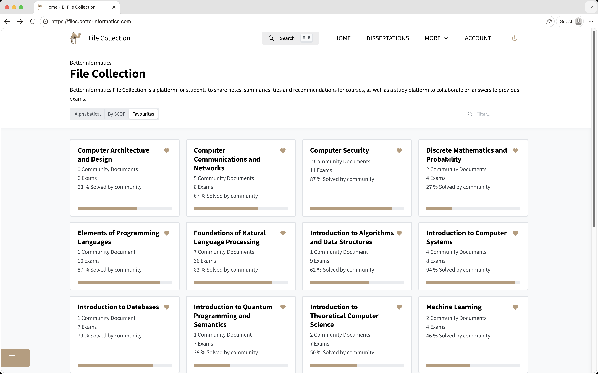
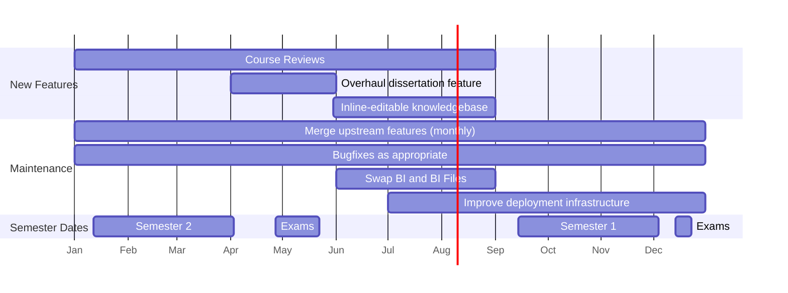

<p align="center">
  

  <p align="center">Platform for crowdsourcing Informatics study materials.<br />Passionately built by students, for students.</p>

  <p align="center">
    <strong><a href="https://files.betterinformatics.com">files.betterinformatics.com</a></strong>
  </p>

  
</p>

## Project Overview

This is the codebase of Better Informatics File Collection serving University of
Edinburgh Informatics students! The service is a customised/vendored fork of a
GPL-licensed software called "Community Solutions", developed originally by
students at ETH Zurich for their own exam collection.

Our fork contains many original features, like support for passwordless auth,
Euclid Course Codes, email notifications, knowledgebase, etc. At the same time,
many components remain identical to the original code (hereon referred to as
"upstream"). Every once in a while, we merge upstream commits into our fork to
keep up to date with useful features, also send PRs to upstream with some of our
own features if they're applicable across universities.

For any questions regarding this project (including dev help), reach out to the
Better Informatics Administrators on the [CompSoc Discord](https://comp-soc.com/discord)
or [CompSoc IRC](https://comp-soc.com/irc). Alternatively, write a GitHub issue!

## Table of Contents

- [Project Overview](#project-overview)
- [Table of Contents](#table-of-contents)
- [How do I contribute?](#how-do-i-contribute)
- [Tech Stack Overview](#tech-stack-overview)
- [Getting Started Locally](#getting-started-locally)
  - [Mise](#mise)
  - [Terminal Setup](#terminal-setup)
    - [Terminal 1 : Services](#terminal-1--services)
    - [Terminal 2 : Backend](#terminal-2--backend)
    - [Terminal 3 : Frontend](#terminal-3--frontend)
  - [Alternative Docker-Compose Setup](#alternative-docker-compose-setup)
  - [Troubleshooting](#troubleshooting)
- [Additional Information and Resources](#additional-information-and-resources)
  - [Pre-commit hooks](#pre-commit-hooks)
  - [Editing frontend code](#editing-frontend-code)
  - [Editing the backend code](#editing-the-backend-code)
  - [Testing](#testing)
  - [Sending a Pull Request](#sending-a-pull-request)
- [Observability](#observability)
  - [Start showcase infrastructure](#start-showcase-infrastructure)
  - [What is observability](#what-is-observability)
  - [Used components](#used-components)
- [Deployment](#deployment)
  - [About the Dockerfile](#about-the-dockerfile)
  - [About cinit](#about-cinit)
  - [About the production instance](#about-the-production-instance)
- [2026 Plans](#2026-plans)
- [License](#license)

## How do I contribute?

**There is no barrier to contribution!**
- If you would like to learn about and contribute to the codebase, please keep
  reading.
- If you are instead looking to contribute data like model answers, cheatsheets,
  or links, please visit the [live instance itself](https://files.betterinformatics.com).

## Tech Stack Overview

Community Solutions has two parts. The backend API (`/backend`) is written in
Python with the Django framework. The frontend (`/frontend`) is written in
TypeScript with React and is a single-page app. While the production instance
packages both into one Docker image, **it is recommended that you launch the**
**two parts separately** when developing locally.

To develop locally, you will need:
- [Mise](https://mise.jdx.dev/installing-mise.html) for toolchain management
- [Docker Compose](https://docs.docker.com/compose/install/) for extra services

This works across all major OSes: Windows, macOS, Linux are all supported.

Advanced users who don't want to install Mise can also try using Docker for all
components (as described [here](#alternative-docker-compose-setup)). However,
there are many drawbacks like larger overhead and less snappy dev cycles.

## Getting Started Locally

<details>
<summary>Install Mise (skip if you have <code>mise</code> available)</summary>

### Mise

Mise allows you to easily download all the correctly versioned tools into the
project directory (no need to worry about it cluttering your system or messing
up other paths).

- On MacOS, `brew install mise`
- On Windows, `winget install mise`
- On other systems, follow the installation guide linked above.

Once Mise is installed:

- On MacOS/Linux, add the `eval "$(mise activate <shell>)"` line to your shell
  config
- On Windows, add `%localappdata%\mise\shims` to your PATH

Finally, run `mise install` in the Community Solutions source directory to
install the required tools.

_NOTE: Non-essential tools you need can be added to `mise.local.toml`._

</details>

### Terminal Setup

The main way to develop is to have three separate terminals:

- One for the frontend using node (yarn) with hot-reload
- One for the backend using python (uv) with hot-reload
- One for running the remaining services like PostgreSQL/rclone with docker-compose

Start the terminals in the following order to ensure a correct startup.

#### Terminal 1 : Services

You will need **Docker Compose** to start up any extra services. See the
[official install instructions](https://docs.docker.com/compose/install/) for
detailed explanation of how to install Docker.

This will start up required services, like a local postgres and rclone S3 server.
The first time around this can take a while to start up.

```sh
docker compose up postgres rclone rclone-create-bucket
```

<details>
<summary>How to check everything is running fine?</summary>

Key things to look for:

- Is postgres running successfully? Look for the following lines:
  ```sh
  postgres  | 2026-02-18 11:03:51.926 UTC [1] LOG:  listening on IPv4 address "0.0.0.0", port 5432
  ...
  postgres  | 2026-02-18 11:03:51.936 UTC [1] LOG:  database system is ready to accept connections
  ```
- Is rclone running successfully?
  ```sh
  rclone-1  | 2026/04/25 21:45:55 NOTICE: Warning: Allow origin set to *. This can cause serious security problems.
  rclone-1  | 2026/04/25 21:45:55 NOTICE: Local file system at /data: Starting s3 server on [http://[::]:9000/]
  ```

</details>

#### Terminal 2 : Backend

The backend is a django python app. You have to enter the `backend` directory to
work on it. We use `uv` for Python package management (which should be installed
by Mise automatically).

By using `uv run manage.py` (instead of just `python manage.py`) it ensures that
you always have the correct (versioned) dependencies installed locally.

The `migrate` command runs the required database migrations. It is only required
on first launch or if there are any database schema changes.

The `runserver` command starts up the django app with hot-reload. Saving a file
will restart the server automatically without you having to rerun the command.

```sh
cd backend
mkdir -p intermediate_pdf_storage
uv run manage.py migrate # only on first run, or if DB schema changed
uv run manage.py runserver 127.0.0.1:8081
```

The backend now runs locally on port `8081`.

#### Terminal 3 : Frontend

The frontend is a React app. You have to enter the `frontend` directory to work
on it. We use `yarn` for Node package management (which should be installed by
Mise automatically), and specifically we use [Vite](https://vite.dev) as the
development/build toolchain.

The `yarn` command only needs to be rerun if any dependencies change or are updated.

```sh
cd frontend
yarn # only if any Node dependencies changed
yarn start --host
```

Website is now accessible at http://localhost:3000

### Alternative Docker-Compose Setup

If desired, the backend (`Terminal 2`) and frontend (`Terminal 3`) can be launched using docker-compose.

This method is less flexible than running it fully locally, so prefer the above setup.

> Important!
>
> When running the backend with docker-compose, you **HAVE** to add `rclone` to your `/etc/hosts` or else documents won't work on the frontend (this is not required if fully using mise)!
>
> - Edit your host file at `/etc/hosts` to include the line `127.0.0.1 rclone`.
>   This will allow your browser to get documents directly from rclone.

If you want to run the _backend_ in docker-compose, remove the targets for the docker compose command for `Terminal 1` and simply run:

```sh
docker compose up
```

If you want to additionally run the _frontend_ in docker-compose, add the `--profile frontend` flag to the docker-compose command from `Terminal 1` (the flag **HAS** to come before the `up`).

```sh
docker compose --profile frontend up
# or if you ONLY want the frontend without backend:
# docker compose up react-frontend postgres rclone rclone-create-bucket
```

If you are too lazy to type it every time, create a `.env` file in this directory and add the line `COMPOSE_PROFILES=frontend`.

### Troubleshooting

If something doesn't work, it's time to figure out what broke. The following
points serve as a starting point to figure out what went wrong. It is usually
always good to make sure you're on the latest commit of the branch with
`git pull`.

- **localhost:3000 shows nothing:** This is usually if the frontend failed to
  startup.
  Check the terminal where you did `yarn start`. Usually React is very
  informative on what went wrong. Most often it's simply a package issue and
  you'll want to quickly run `yarn` to install/update/remove the required
  packages. Do note, it can sometimes take a while to startup. The webpage is
  only accessible once Vite shows you the URL.

- **The homepage works, but I get errors of type `ECONNREFUSED` or `ENOTFOUND`:**
  This means your frontend can't communicate with the backend.
  Is the backend running without errors? You should be able to see something
  on <http://localhost:8081/> (no HTTP**S**). If not, something is wrong with
  the backend.

- **Backend doesn't work:** The logs from the docker-compose are formatted so
  that you have the service name on the left and the logs on the right.
  `community-solutions` is the backend Django service. Have a look at what is
  being printed there. If it's along the lines of it not being able to connect
  to the Postgres database, that's usually a problem with Postgres not able
  to start up. Search for the latest logs of Postgres which tell you if
  Postgres started up successfully or failed. Those can help you debug.
  For a "turn it off and on again" solution you can often simply type
  `docker compose down -v` to make sure all the services are shut down
  before starting it again with `docker compose up --build`. If that doesn't
  the problem, you can also delete the Postgres folder `data/sql` which will
  force the Postgres service to completely build the database from scratch.

- **`UnknownErrorException` when accessing exams/documents:** This is very
  likely caused by rclone not being in your hosts file. Your browser gets an url
  with rclone as the host, but if rclone is not in your hosts file, it won't be
  redirected correctly.

## Additional Information and Resources

This section is not directly relevant for getting the local development setup
running, but can be beneficial to read into to learn more about the tools used
and further resources to look into.

### Pre-commit hooks

There are pre-commit hooks for the frontend and backend for formatting code.
If you have run `mise install` already, then running `prek install` will setup
your local `.git/hooks/pre-commit` to automatically perform formatting when
committing code.

### Editing frontend code

`frontend/app.tsx` is the entrypoint for the frontend. We use `react-router` as
the routing library.

Most editors have plugins/extensions that you can optionally install to get
real-time linter feedback from [eslint](https://eslint.org) while you edit.
You can also run the linter manually with `yarn run lint`.

After editing files, it's time to send in a pull request!

Before creating a pull request, it would be nice if you autoformat your code to
clean up bad indentation and the like. We use prettier for this, and it can be
run using `yarn run format` if you use Yarn locally. The pre-commit hook (if you
chose to install it) takes care of this.

### Editing the backend code

Django separates logical components into "apps". You can see this separation in
the directory structure within `/backend`. To see the list of all apps loaded,
check `/backend/backend/settings.py`.

Each app directory has a `urls.py` file describing the backend API routes. This
file references functions in `views.py` to handle the requests. Data structures
are in `models.py` and unit tests in `tests.py`.

Each model class **directly corresponds** to a database schema. Thus, you should
edit these with care. When modifying an existing model, or when creating new
models/apps, run

```bash
cd backend
uv run manage.py makemigrations
```

to create "migration files", so that the database will know how to migrate data
from the previous schema to the new one. You may also want to apply this
migration.

```bash
cd backend
uv run manage.py migrate
```

You should unapply this migration before switching to a branch that doesn't have
your code, to prevent database corruption.

Migrations are a common source of headache when applied wrongly, so be careful
when switching between Git branches with different schemas! For example, running
upstream Community Solutions code locally with an Edinburgh-schema database will
corrupt it entirely. If you frequently switch wildly different schemas (like
upstream and our fork), it might be worth having multiple `data/sql-...` copies
that you simlink to `data/sql` when switching.

But, sometimes, sadly, nuking your `data/sql` directory and restarting your
Docker backend to rebuild it is the best.

### Testing

To fill the website with users, exams and documents, there is a command to fill
your local instance with a bunch of test data. This process can take up to 10
minutes because it generates a lot of data. Accessing the frontend during this
time can corrupt the database, so **we recommend stopping the frontend process**.

```bash
cd backend
uv run manage.py create_testdata
```

### Sending a Pull Request

After you make your edits and verified it works with test data, you have to send
our repository a pull request.

1. First, fork this GitHub repository to your own account with a browser.
2. Then, create a new branch in your fork for your feature/bug-fix.
3. Push your changes to this branch in your fork.
4. Finally, open a Pull Request from your fork to our `master` branch.

## Observability

### Start showcase infrastructure

Sometimes, it is helpful to have just a little bit more data at disposal, to monitor applications or to debug performance issues.
We provide a "simple" setup that automatically gathers all information (traces, metrics & logs) for local setup, including Grafana.
Interesting Grafana dashboard should also be shipped in `./contrib` to allow fairly easy deployments of such advanced features.

To try, run:

```bash
# For running frontend locally:
docker compose -f docker-compose.yml -f docker-compose.observability.yml up --build
cd frontend
yarn start-with-faro

# For running frontend in docker:
docker compose -f docker-compose.yml -f docker-compose.observability.yml --profile frontend up --build
```

Now you can access:

- Community solutions frontend on [localhost:3000](http://localhost:3000)
- Grafana / Monitoring data on [localhost:3001](http://localhost:3001)

For Grafana, look at the sidebar, search for "Explore" and "Drilldown" and "Traces". There, you can have a quick overview. You can select appropriate traces, which usually start in the browser of the user, then to the backend where multiple DB queries are started. There are many other things you can do with the data and other ways to query for it, familiarize yourself with Grafana, Prometheus, Tempo, Loki, (Pyroscope)... if interested:)

### What is observability

In short, there are 3 important kinds of data that we focus on: logs, metrics and traces. Logs are simply error (warning, info, ...) logs that you usually see in the console. Metrics are usually just numbers in a time interval, such as number of get requests in the last minute, and so on. Traces are more involved, and they focus on interactions between microservices, requests, queries and so on. They contain start and end times, but also additional information (such as an exact query or URL).

There are also profiles, however these are more familiar from local debugging and performance testing and have been rarer to find in production at scale. Hence, while not as integrated as other data, it too can be measured and provide valuable insights.

### Used components

Behind the scenes, the following components are used:

- Faro: SDK used by frontend for collecting traces (e.g. browser stats, client fetch, console logs etc)
- Alloy: A component that exposes an endpoint that Faro can push its data to. While unused, it also has builtin exporters, receivers, processors for many kinds of data.
- Tempo: "Database" storing traces, which Alloy will forward received traces to. They can be received via the TraceQL query language.
- Loki: "Database" storing logs, which Alloy will forward logs to. They can be received via the LogQL query language.
- Prometheus: "Database" storing metrics. It too can either receive data from Alloy, or scrape data itself. The metrics can be received via the PromQL query language.
- Pyroscope: "Database" storing profiles at scale. The Django backend directly pushes its generated profiles to Pyroscope.
- Grafana: Visualization of all data, can be used to build dashboards to view applications status at a glance or in great detail.


## Deployment

This section is only interesting if you want to contribute to the deployment and
administration of File Collection as a service.

### About the Dockerfile

The root Dockerfile is a multi-staged Dockerfile. The `combined` stage creates
the production-ready image, while the `backend-hotreload` stage is what is
usually used for local development (if you use Docker Compose). Essentially,
for production, we build and package up the entire frontend as a module within
the backend (as `/backend/frontend`). This allows a single Docker image to
contain the entirety of Community Solutions. In production, we deploy this image
and point it to a separately deployed PostgreSQL and S3 instance.

### About cinit

The image uses [`cinit`](https://dev.vseth.ethz.ch/how-to-develop-on-the-sip/how-to-run-apps-in-containers-cinit) to bootstrap multiple processes within one
image. This is basically like Docker Compose but within a single image.
`cinit.yaml` specifies the order that various bootstrap scripts are run before
the main Django instance (where we also use `gunicorn` for multiple workers).

The cinit file contains some legacy configurations specific to upstream, but you
can for the most part ignore them. (One day we need to clean it up...)

### About the production instance

Once a commit is merged into the master branch, the production instance is
automatically updated. Specifically, the production instance runs on a
Kubernetes cluster within CompSoc's Tardis account, and the CI performs a
rolling restart on it to allow crashes to immediately be spotted. The database
is hosted with Docker Compose outside of the cluster for persistence (with
nightly backups), and for S3 we use Tardis' hosted Minio service.

In case the CI is broken and you need to manually deploy an image, or in case
you are trying to run Community Solutions on your own server, follow these steps:

1. Run `docker build -t yourname/yourtag .` to build the image properly, which
   will also build the frontend, optimise it for production (this can take 5-10
   minutes), and bundle it together with the backend in a single image.
2. You can then run this image in production using either Docker or Kubernetes.
3. Make sure to configure any runtime environment variables (such as the
   Postgres DB details) using Docker's `-e` flag or any equivalent.
4. To handle authentication (signing JWT tokens to prevent forgery), the backend
   requires an RSA private/public keypair to be available at the path specified
   at `RUNTIME_JWT_PRIVATE_KEY_PATH` and `RUNTIME_JWT_PUBLIC_KEY_PATH`
   environment variables. During local development, this can be left empty to
   use an empty string as the key. For production, you should pre-generate this
   with e.g. openssl, and use mounted volumes to make it available within the
   deployment image (such as Docker Compose volumes or Kubernetes secret mounts).
5. A GSuite credentials file should also be passed to the container (similar to
   keypair procedure), so that it can send email verification emails as a GSuite
   user. This can also be left empty during local development, which will make
   emails display to console instead.

## 2026 Plans



## License

This program is free software: you can redistribute it and/or modify
it under the terms of the GNU General Public License as published by
the Free Software Foundation, either version 3 of the License, or
(at your option) any later version.

This program is distributed in the hope that it will be useful,
but WITHOUT ANY WARRANTY; without even the implied warranty of
MERCHANTABILITY or FITNESS FOR A PARTICULAR PURPOSE. See the
GNU General Public License for more details.

You should have received a copy of the GNU General Public License
along with this program. If not, see <https://www.gnu.org/licenses/>
